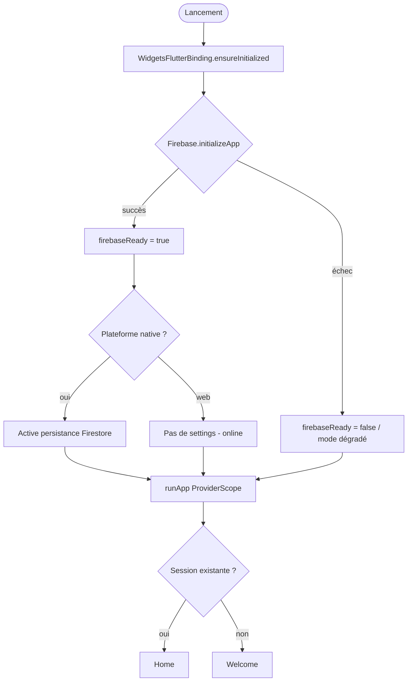
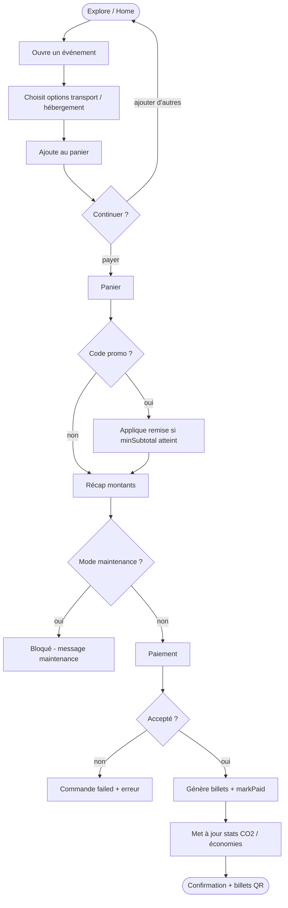
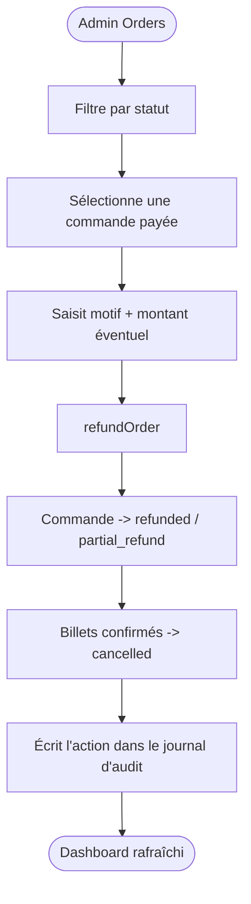

# Diagrammes d'activité (Pulsar)

## 1. Démarrage de l'application

```mermaid
flowchart TD
    A([Lancement]) --> B[WidgetsFlutterBinding.ensureInitialized]
    B --> C{Firebase.initializeApp}
    C -->|succès| D[firebaseReady = true]
    C -->|échec| E[firebaseReady = false / mode dégradé]
    D --> F{Plateforme native ?}
    F -->|oui| G[Active persistance Firestore]
    F -->|web| H[Pas de settings - online]
    G --> I[runApp ProviderScope]
    H --> I
    E --> I
    I --> J{Session existante ?}
    J -->|oui| K[Home]
    J -->|non| L[Welcome]
```

## 2. Parcours de réservation (utilisateur)

```mermaid
flowchart TD
    A([Explore / Home]) --> B[Ouvre un événement]
    B --> C[Choisit options transport / hébergement]
    C --> D[Ajoute au panier]
    D --> E{Continuer ?}
    E -->|ajouter d'autres| A
    E -->|payer| F[Panier]
    F --> G{Code promo ?}
    G -->|oui| H[Applique remise si minSubtotal atteint]
    G -->|non| I[Récap montants]
    H --> I
    I --> J{Mode maintenance ?}
    J -->|oui| K[Bloqué - message maintenance]
    J -->|non| L[Paiement]
    L --> M{Accepté ?}
    M -->|non| N[Commande failed + erreur]
    M -->|oui| O[Génère billets + markPaid]
    O --> P[Met à jour stats CO2 / économies]
    P --> Q([Confirmation + billets QR])
```

## 3. Modération admin (remboursement)

```mermaid
flowchart TD
    A([Admin Orders]) --> B[Filtre par statut]
    B --> C[Sélectionne une commande payée]
    C --> D[Saisit motif + montant éventuel]
    D --> E[refundOrder]
    E --> F[Commande -> refunded / partial_refund]
    F --> G[Billets confirmés -> cancelled]
    G --> H[Écrit l'action dans le journal d'audit]
    H --> I([Dashboard rafraîchi])
```
