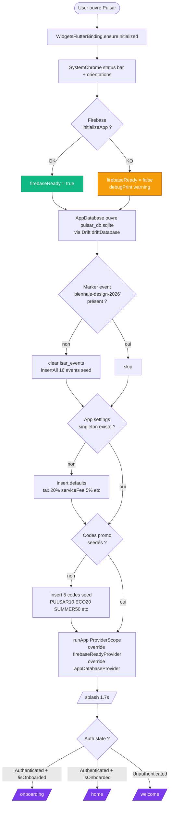
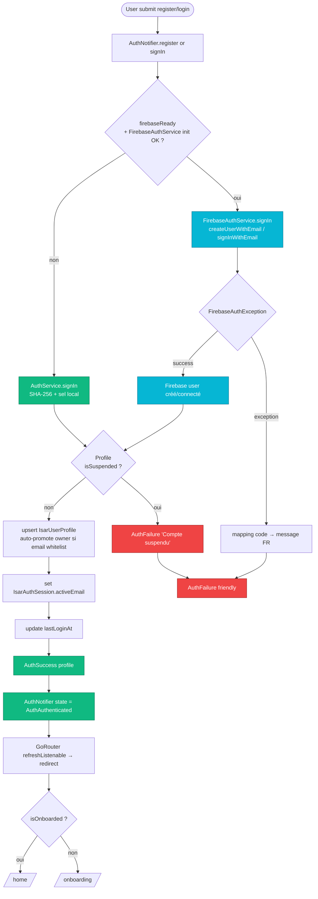
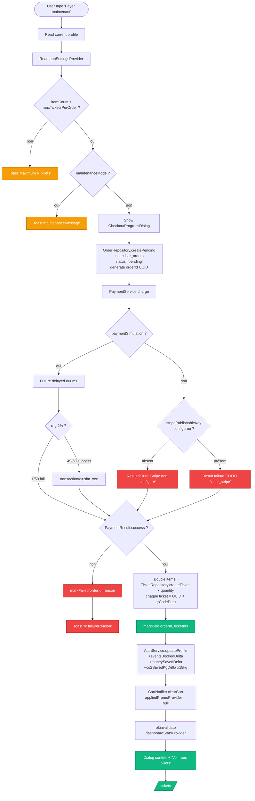
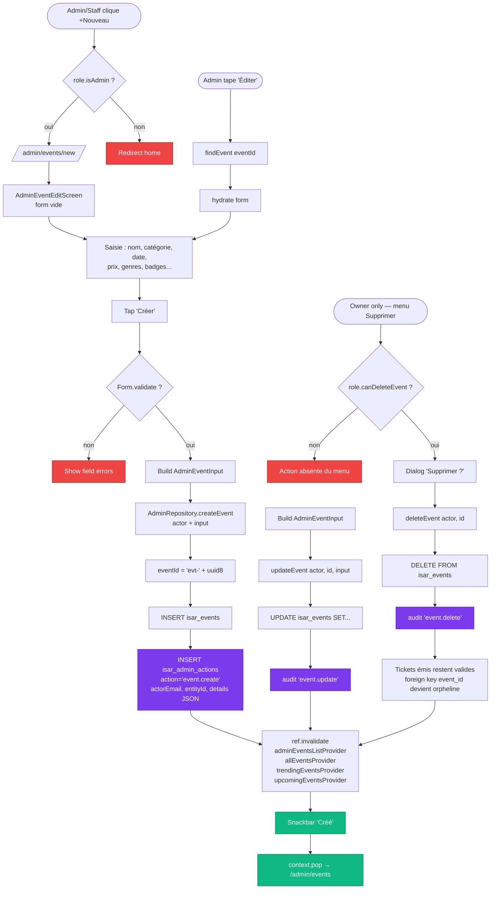
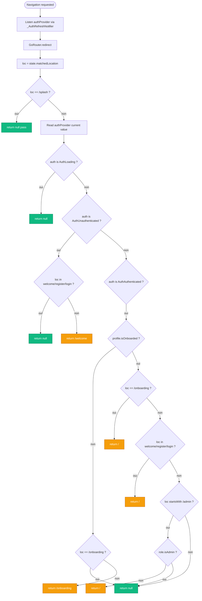
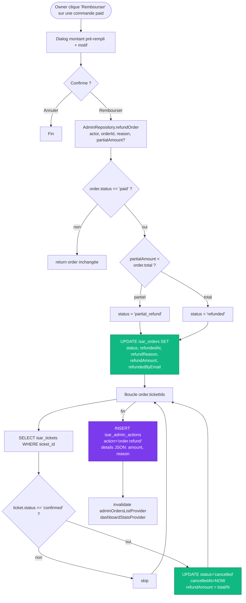
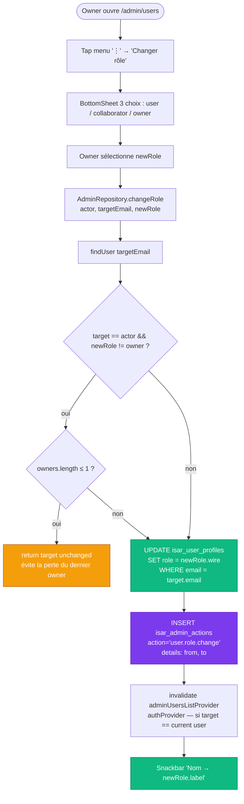
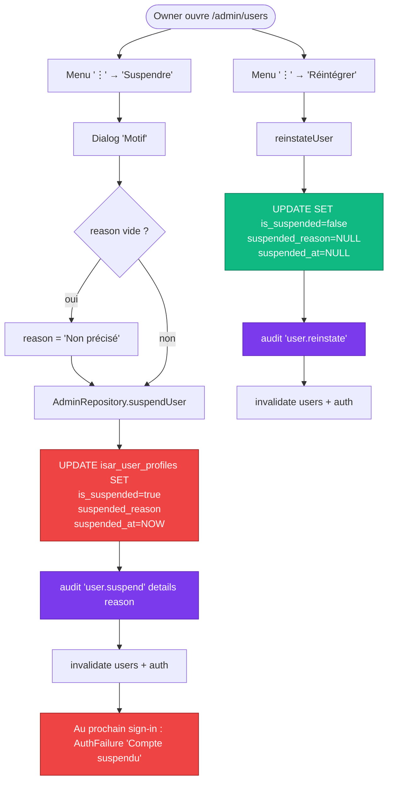
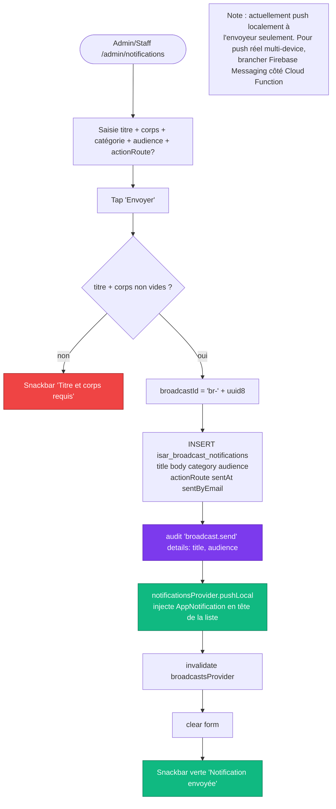
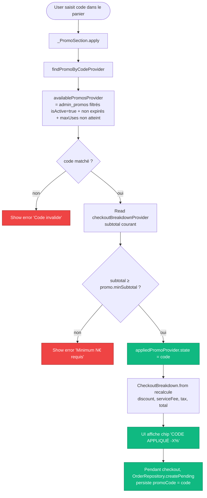

# Pulsar — Diagrammes d'activité

Les flux critiques de l'app, du démarrage à un refund admin.

## 1. Démarrage de l'app

## 2. Auth — Register & Sign-in (fallback Firebase → local)

## 3. Checkout — Panier → Order → Paiement → Tickets

## 4. Admin — CRUD événement avec audit log

## 5. Router guard — Redirect logic

## 6. Refund — Admin rembourse une commande

## 7. Change role — Owner promeut un user

## 8. Suspend / Reinstate user

## 9. Broadcast notification

## 10. Promo apply au checkout

