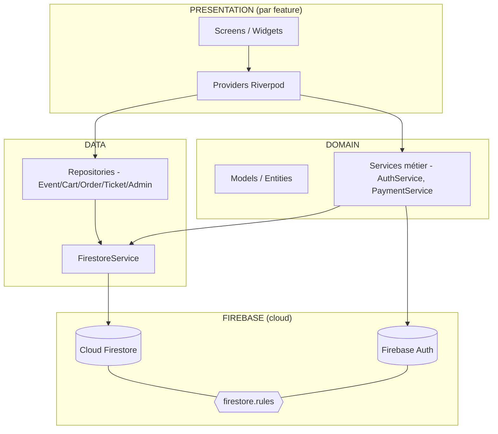
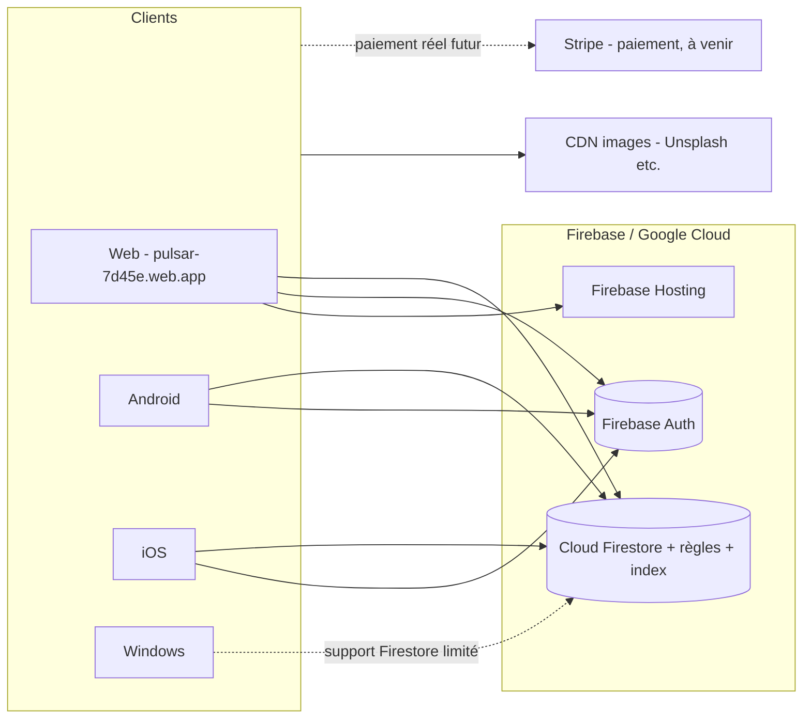

# Architecture globale (Pulsar)

> Backend : **Cloud Firestore + Firebase Auth** (mis à jour après migration depuis Isar/Drift).

## Vue d'ensemble (Clean Architecture, Feature-First)

## Diagramme de déploiement

## Notes
- **Offline-first** sur natif : persistance Firestore (IndexedDB désactivée sur web — voir `main.dart`).
- **Sécurité** : `firestore.rules` (RBAC owner/collaborator/user, audit append-only, default-deny).
- **Limite connue** : totaux de commande calculés côté client → prévoir **Cloud Functions + webhook Stripe** pour la prod payante.
- ⚠️ `cloud_firestore` n'est pas officiellement supporté sur **Windows desktop** : tester sur web/Android/iOS.
