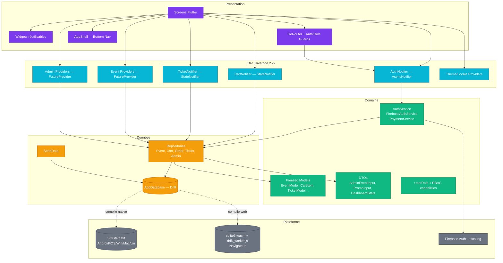
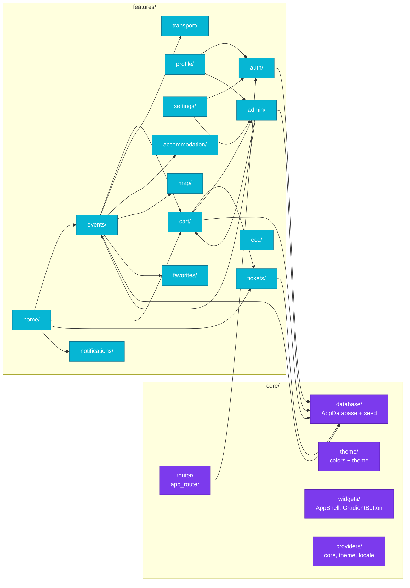
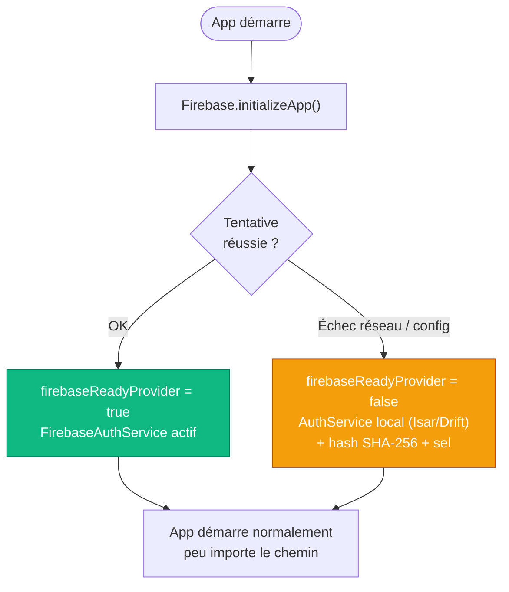

# Pulsar — Architecture globale

## Vue d'ensemble (Clean Architecture, Feature-First)



## Modules par feature



## Déploiement multi-plateforme

```mermaid
graph TB
    SRC[Code source Dart unique]

    subgraph "Build Flutter"
        BWEB[flutter build web --release]
        BANDROID[flutter build apk --release]
        BIOS[flutter build ipa --release<br/>Mac requis]
        BWIN[flutter build windows --release]
    end

    subgraph "Distribution"
        FBH[Firebase Hosting<br/>pulsar-7d45e.web.app]
        GHR[GitHub Releases<br/>github.com/TOGOM91/Pulsar/releases]
        TF[TestFlight Apple]
        PS[Play Store / sideload]
    end

    subgraph "Runtime BDD"
        WASM[(SQLite WASM<br/>IndexedDB)]
        SQNATIVE[(SQLite natif<br/>fichier .sqlite local)]
    end

    SRC --> BWEB & BANDROID & BIOS & BWIN

    BWEB --> FBH
    BANDROID --> GHR & PS
    BIOS --> TF
    BWIN --> GHR

    FBH -.via drift_worker.js.-> WASM
    BANDROID -.sqlite3_flutter_libs.-> SQNATIVE
    BIOS -.sqlite3_flutter_libs.-> SQNATIVE
    BWIN -.sqlite3_flutter_libs.-> SQNATIVE

    classDef build fill:#7C3AED,stroke:#5B21B6,color:#fff
    classDef dist fill:#06B6D4,stroke:#0E7490,color:#fff
    classDef runtime fill:#10B981,stroke:#047857,color:#fff
    class BWEB,BANDROID,BIOS,BWIN build
    class FBH,GHR,TF,PS dist
    class WASM,SQNATIVE runtime
```

## Tolérance Firebase (fail-safe)


