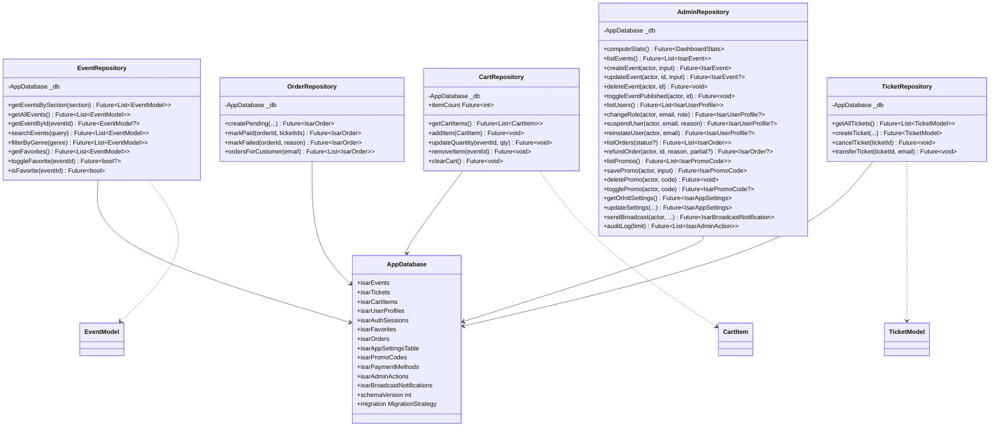
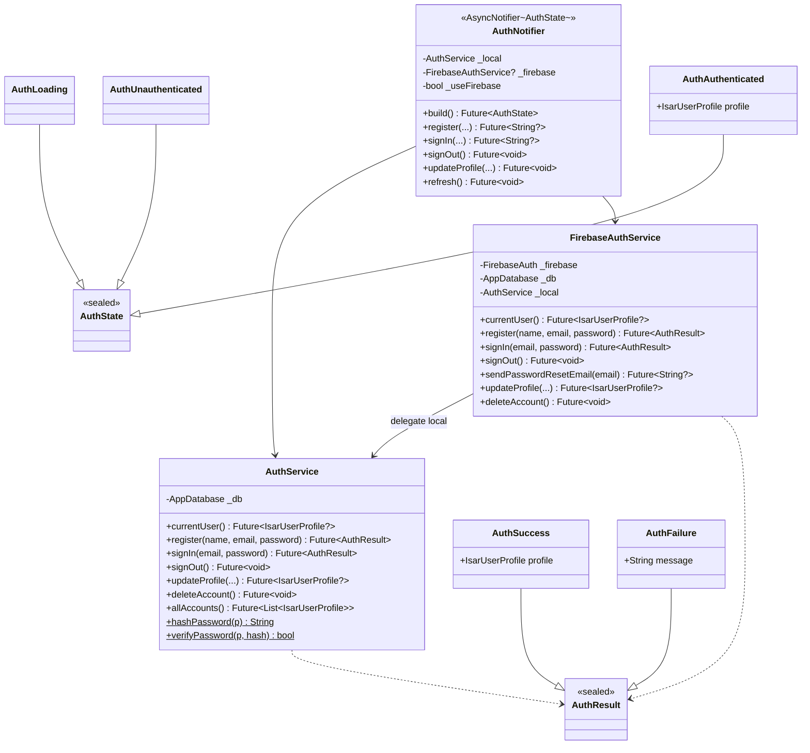
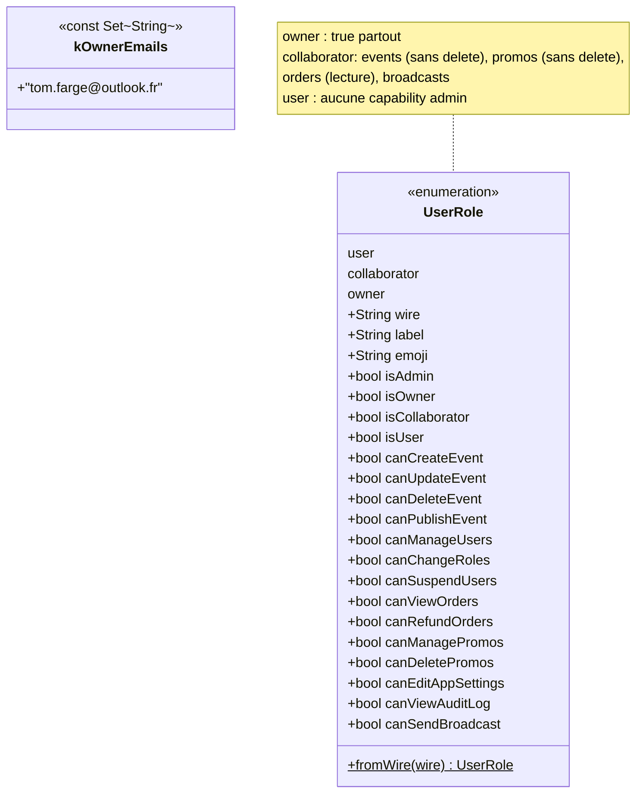
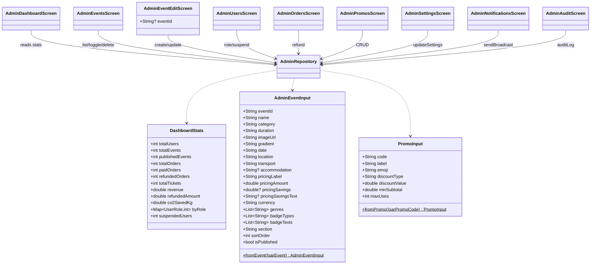
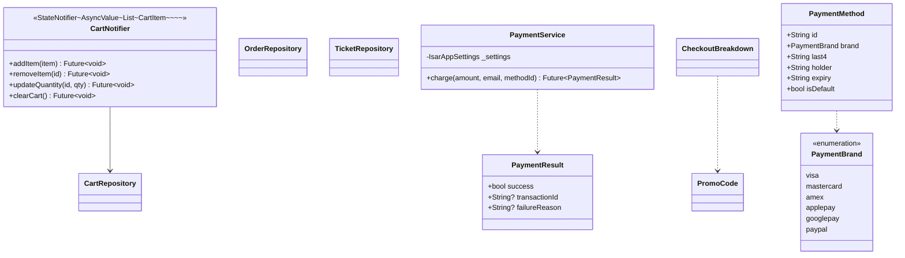

# Pulsar — Diagrammes de classes

Découpés par sous-système pour rester lisibles.

## 1. Modèles de domaine (Freezed)

```mermaid
classDiagram
    class EventModel {
        +String id
        +String name
        +String category
        +String duration
        +String imageUrl
        +String gradient
        +List~EventBadge~ badges
        +EventDetails details
        +EventPricing pricing
        +List~String~ genres
        +bool isFavorite
        +int delayAnimation
        +copyWith() EventModel
    }

    class EventBadge {
        +String type
        +String text
    }

    class EventDetails {
        +String date
        +String location
        +String transport
        +String? accommodation
    }

    class EventPricing {
        +String label
        +double amount
        +double? savings
        +String? savingsText
        +String currency
    }

    class CartItem {
        +String eventId
        +String eventName
        +String eventDate
        +String eventLocation
        +String? eventImageUrl
        +double unitPrice
        +int quantity
        +String ticketType
        +String? transportOption
        +double? transportPrice
        +String? accommodationOption
        +double? accommodationPrice
        +double totalPrice
    }

    class TicketModel {
        +String id
        +String eventId
        +String eventName
        +String eventDate
        +String eventLocation
        +String? eventImageUrl
        +double price
        +String ticketType
        +TicketStatus status
        +DateTime purchaseDate
        +String? qrCodeData
        +String? seatInfo
        +String? transferredToEmail
        +DateTime? cancelledAt
        +double? refundAmount
        +DateTime? eventDateParsed
    }

    class UserModel {
        +String id
        +String name
        +String email
        +String? avatarUrl
        +int memberSince
        +UserPreferences preferences
        +UserStats stats
    }

    class UserPreferences {
        +List~String~ genres
        +double budgetMax
        +String location
        +String language
        +bool darkMode
    }

    class UserStats {
        +int eventsBooked
        +double co2SavedKg
        +double moneySavedEur
        +int percentile
    }

    class PromoCode {
        +String code
        +String label
        +double? percentOff
        +double? amountOff
        +double minSubtotal
        +String emoji
        +discountFor(double subtotal) double
    }

    class CheckoutBreakdown {
        +double subtotal
        +double discount
        +double serviceFee
        +double tax
        +double total
        +PromoCode? appliedPromo
        +from(subtotal, promo, taxRate, serviceFeeRate)$
    }

    class AppNotification {
        +String id
        +NotificationCategory category
        +String title
        +String body
        +DateTime time
        +bool isRead
        +String? actionRoute
        +String? imageUrl
        +copyWith() AppNotification
    }

    class TicketStatus {
        <<enumeration>>
        confirmed
        cancelled
        transferred
        used
        expired
    }

    class NotificationCategory {
        <<enumeration>>
        event
        transport
        eco
        social
        system
    }

    EventModel "1" *-- "*" EventBadge
    EventModel "1" *-- "1" EventDetails
    EventModel "1" *-- "1" EventPricing
    UserModel "1" *-- "1" UserPreferences
    UserModel "1" *-- "1" UserStats
    TicketModel ..> TicketStatus
    AppNotification ..> NotificationCategory
    CheckoutBreakdown "1" o-- "0..1" PromoCode
```

## 2. Couche données (Repositories + Drift)

## 3. Authentification (services + état)

## 4. RBAC (rôles & capabilities)

| Capability | user | collaborator | owner |
|---|:-:|:-:|:-:|
| `canCreateEvent` |   | ✅ | ✅ |
| `canUpdateEvent` |   | ✅ | ✅ |
| `canDeleteEvent` |   |   | ✅ |
| `canPublishEvent` |   | ✅ | ✅ |
| `canManageUsers` |   |   | ✅ |
| `canChangeRoles` |   |   | ✅ |
| `canSuspendUsers` |   |   | ✅ |
| `canViewOrders` |   | ✅ | ✅ |
| `canRefundOrders` |   |   | ✅ |
| `canManagePromos` |   | ✅ | ✅ |
| `canDeletePromos` |   |   | ✅ |
| `canEditAppSettings` |   |   | ✅ |
| `canViewAuditLog` |   |   | ✅ |
| `canSendBroadcast` |   | ✅ | ✅ |

## 5. Module Admin (UI + providers)

## 6. Checkout (services + flow)

