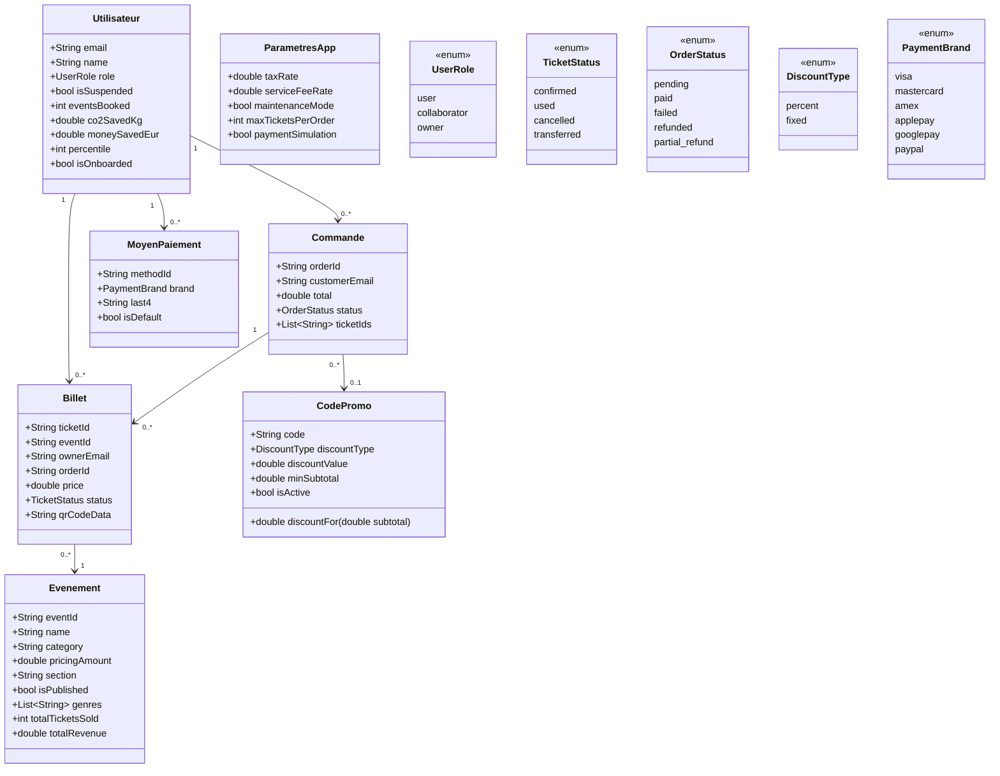
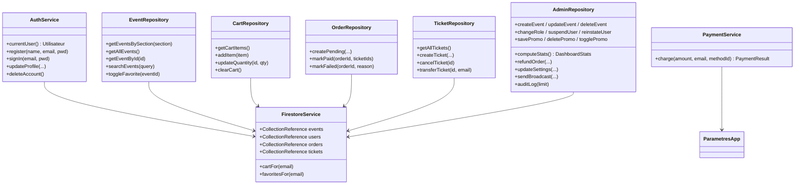

# Diagramme de classes (Pulsar)

Découpé par sous-système. Modèles = `lib/core/database/models.dart` ;
services = couche `data/` ; énumérations = domaine métier.

## 1. Modèles de domaine

## 2. Couche data (services / repositories)

