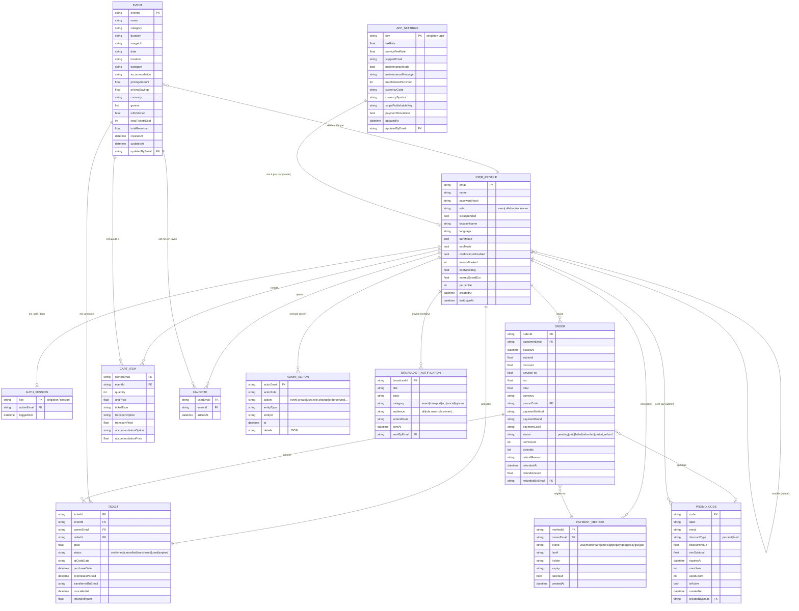

# Pulsar — Modèle Conceptuel de Données (MCD)

Vue métier des entités et de leurs relations.
Les attributs identifiants sont préfixés `#`. Les relations portent un verbe et leur cardinalité.

## Diagramme global

## Cardinalités principales

| Relation | Cardinalité | Sens métier |
|---|---|---|
| USER_PROFILE — ORDER | 1,1 — 0,N | Un utilisateur passe 0 à N commandes ; chaque commande appartient à 1 client |
| USER_PROFILE — TICKET | 1,1 — 0,N | Multi-comptes : tickets scopés par `ownerEmail` |
| USER_PROFILE — CART_ITEM | 1,1 — 0,N | Panier per-user (vide à l'inscription, reset au sign-out) |
| USER_PROFILE — FAVORITE | 1,1 — 0,N | Favoris par utilisateur |
| EVENT — TICKET | 1,1 — 0,N | Un event peut être vendu en N tickets |
| EVENT — CART_ITEM | 1,1 — 0,N | Idem côté panier |
| ORDER — TICKET | 1,1 — 1,N | Une commande génère 1 à N tickets (`ticketIds` list) |
| ORDER — PROMO_CODE | 0,N — 0,1 | Une commande peut avoir 0 ou 1 promo |
| AUTH_SESSION — USER_PROFILE | 0,1 — 0,1 | Singleton ; `activeEmail` null = déconnecté |
| ADMIN_ACTION — USER_PROFILE | 1,1 — 0,N | Chaque action a un acteur unique |

## Contraintes

- **Singletons** : `AUTH_SESSION.key = 'session'`, `APP_SETTINGS.key = 'app'` — clé unique imposée par index UNIQUE Drift.
- **Audit immutable** : aucune mise à jour ni suppression sur `ADMIN_ACTION` (append-only).
- **Auto-promotion** : `kOwnerEmails` whitelist force `role = 'owner'` pour Tom et co-fondateurs à chaque login.
- **Soft delete via `isSuspended`** : un compte suspendu reste en BDD mais bloqué au sign-in.
- **Soft publish via `isPublished`** : un event non publié n'apparaît pas dans `EventRepository.getAllEvents()` mais reste visible côté admin.
