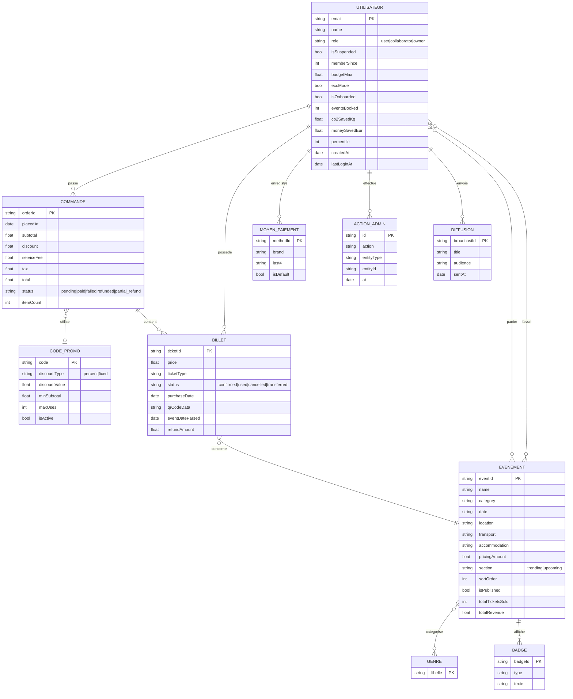

# MCD — Modèle Conceptuel de Données (Pulsar)

> Backend réel : **Cloud Firestore** (documentaire). Le MCD exprime le métier ;
> la traduction NoSQL est dans `mld.md`.

## Diagramme entité-association (Mermaid)

## Cardinalités (min,max) — notation Merise

| Association | Côté A | Côté B |
|-------------|--------|--------|
| passe (UTILISATEUR–COMMANDE) | (0,n) | (1,1) |
| possede (UTILISATEUR–BILLET) | (0,n) | (1,1) |
| contient (COMMANDE–BILLET) | (0,n) | (0,1) |
| concerne (BILLET–EVENEMENT) | (0,n) | (1,1) |
| utilise (COMMANDE–CODE_PROMO) | (0,1) | (0,n) |
| panier (UTILISATEUR–EVENEMENT) | (0,n) | (0,n) — *porte : quantite, ticketType, options* |
| favori (UTILISATEUR–EVENEMENT) | (0,n) | (0,n) — *porte : addedAt* |
| categorise (EVENEMENT–GENRE) | (0,n) | (0,n) |
| affiche (EVENEMENT–BADGE) | (1,n) | (1,1) |
| enregistre (UTILISATEUR–MOYEN_PAIEMENT) | (1,1) | (0,n) |
| effectue (UTILISATEUR–ACTION_ADMIN) | (1,1) | (0,n) |
| envoie (UTILISATEUR–DIFFUSION) | (1,1) | (0,n) |

> **PARAMETRES_APP** : entité singleton (document `app_settings/app`), non associée,
> modifiable uniquement par l'owner.
