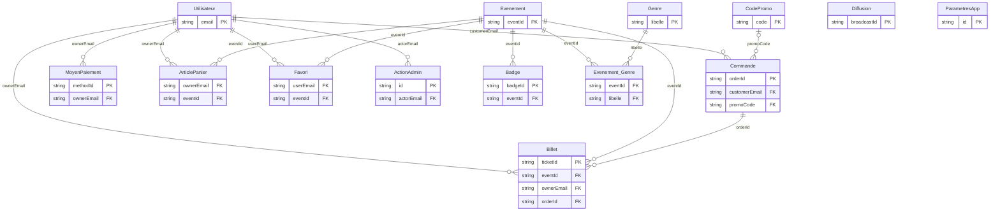

# MLD — Modèle Logique de Données (Pulsar)

> **Backend réel = Cloud Firestore (NoSQL documentaire).** Ce MLD donne d'abord la
> traduction **relationnelle normalisée (3NF)** attendue académiquement, puis le
> **mapping vers la structure Firestore réelle**.
> Source : `lib/core/database/models.dart` + `firestore_service.dart`.

## 1. Schéma relationnel (PK soulignées, FK préfixées `#`)

- **Utilisateur**(_email_, name, avatarUrl, phone, bio, role, isSuspended, suspendedReason, suspendedAt, memberSince, budgetMax, locationName, language, darkMode, notificationsEnabled, emailNotificationsEnabled, socialNotificationsEnabled, ecoMode, showCarbonFootprint, isOnboarded, eventsBooked, co2SavedKg, moneySavedEur, percentile, createdAt, lastLoginAt)
- **Evenement**(_eventId_, name, category, duration, imageUrl, gradient, date, location, transport, accommodation, pricingLabel, pricingAmount, pricingSavings, pricingSavingsText, currency, section, sortOrder, isPublished, totalTicketsSold, totalRevenue, createdAt, updatedAt, #updatedByEmail)
- **Genre**(_libelle_)
- **Evenement_Genre**(_#eventId_, _#libelle_)
- **Badge**(_badgeId_, #eventId, type, texte, ordre)
- **CodePromo**(_code_, label, emoji, discountType, discountValue, minSubtotal, expiresAt, maxUses, usedCount, isActive, createdAt, #createdByEmail)
- **Commande**(_orderId_, #customerEmail, #promoCode_, placedAt, subtotal, discount, serviceFee, tax, total, currency, paymentMethod, paymentBrand, paymentLast4, status, itemCount, failureReason, refundReason, refundedAt, refundAmount, #refundedByEmail_)
- **Billet**(_ticketId_, #eventId, #ownerEmail, #orderId_, price, ticketType, status, purchaseDate, qrCodeData, seatInfo, chosenTransportLabel, chosenTransportCo2SavedKg, transferredToEmail, transferredAt, cancelledAt, refundAmount, eventDateParsed)
- **ArticlePanier**(_#ownerEmail_, _#eventId_, unitPrice, quantity, ticketType, transportOption, transportPrice, accommodationOption, accommodationPrice)
- **Favori**(_#userEmail_, _#eventId_, addedAt)
- **MoyenPaiement**(_methodId_, #ownerEmail, brand, last4, holder, expiry, isDefault, createdAt)
- **ActionAdmin**(_id_, #actorEmail, actorRole, action, entityType, entityId, at, details)
- **Diffusion**(_broadcastId_, #sentByEmail, title, body, category, actionRoute, audience, sentAt)
- **ParametresApp**(_id_, taxRate, serviceFeeRate, supportEmail, maintenanceMode, maintenanceMessage, maxTicketsPerOrder, currencyCode, currencySymbol, stripePublishableKey, paymentSimulation, updatedAt, #updatedByEmail)
- **ParametresFeatured**(_#id_, _#eventId_)

_(le souligné `_..._` marque une composante de clé ; `#..._` = FK nullable)_

## 2. Diagramme relationnel (Mermaid)



## 3. Mapping vers Cloud Firestore (implémentation réelle)

```
events/{eventId}                  ← Evenement  (genres[], badgeTypes[], badgeTexts[] = tableaux inline)
users/{email}                     ← Utilisateur
  ├── cart/{eventId}              ← ArticlePanier
  ├── favorites/{eventId}         ← Favori
  └── payment_methods/{methodId}  ← MoyenPaiement
orders/{orderId}                  ← Commande   (ticketIds[] = tableau)
tickets/{ticketId}                ← Billet
promo_codes/{code}                ← CodePromo
app_settings/app                  ← ParametresApp  (featuredEventIds[] inline)
admin_actions/{id}                ← ActionAdmin (append-only)
broadcasts/{broadcastId}          ← Diffusion
```

**Écarts NoSQL ↔ relationnel (à justifier en soutenance) :**
- **Dé-normalisation** : `Billet` recopie `eventName/eventDate/eventLocation` → lecture instantanée hors-ligne sans jointure.
- **Tableaux inline** : `Evenement.genres/badges`, `Commande.ticketIds`, `ParametresApp.featuredEventIds` remplacent les tables de jointure `Evenement_Genre`, `Badge`, `ParametresFeatured`.
- **Pas de FK** : l'intégrité référentielle est applicative (repositories) + sécuritaire (`firestore.rules`), pas garantie par le moteur.
- **Index composites** : définis dans `firestore.indexes.json` (tickets, orders, events).
