# Pulsar — Modèle Logique de Données (MLD)

Représentation relationnelle telle qu'implémentée dans `lib/core/database/app_database.dart` (Drift / SQLite).
Les colonnes générées sont en `snake_case` au niveau SQL, mais exposées en `camelCase` côté Dart.

## Vue tabulaire

```mermaid
erDiagram
    isar_user_profiles ||--o| isar_auth_sessions : "active_email"
    isar_user_profiles ||--o{ isar_orders : "customer_email"
    isar_user_profiles ||--o{ isar_tickets : "owner_email"
    isar_user_profiles ||--o{ isar_cart_items : "owner_email"
    isar_user_profiles ||--o{ isar_favorites : "user_email"
    isar_user_profiles ||--o{ isar_payment_methods : "owner_email"
    isar_user_profiles ||--o{ isar_admin_actions : "actor_email"
    isar_user_profiles ||--o{ isar_broadcast_notifications : "sent_by_email"
    isar_user_profiles ||--o{ isar_promo_codes : "created_by_email"

    isar_events ||--o{ isar_tickets : "event_id"
    isar_events ||--o{ isar_cart_items : "event_id"
    isar_events ||--o{ isar_favorites : "event_id"

    isar_orders ||--o{ isar_tickets : "order_id"

    isar_user_profiles {
        INTEGER isar_id PK "AUTOINCREMENT"
        TEXT email UK "UNIQUE NOT NULL"
        TEXT name "NOT NULL"
        TEXT password_hash "default ''"
        TEXT avatar_url "nullable"
        TEXT phone "nullable"
        TEXT bio "nullable"
        INTEGER member_since "NOT NULL"
        TEXT genres "JSON list, default ''"
        REAL budget_max "default 300"
        TEXT location_name "default ''"
        TEXT language "default 'fr'"
        INTEGER dark_mode "BOOLEAN default 0"
        INTEGER notifications_enabled "default 1"
        INTEGER email_notifications_enabled "default 1"
        INTEGER social_notifications_enabled "default 0"
        INTEGER eco_mode "default 1"
        INTEGER show_carbon_footprint "default 1"
        INTEGER is_onboarded "default 0"
        INTEGER events_booked "default 0"
        REAL co2_saved_kg "default 0"
        REAL money_saved_eur "default 0"
        INTEGER percentile "default 50"
        INTEGER created_at "datetime NOT NULL"
        INTEGER last_login_at "datetime nullable"
        TEXT role "default 'user'"
        INTEGER is_suspended "default 0"
        TEXT suspended_reason "nullable"
        INTEGER suspended_at "datetime nullable"
    }

    isar_auth_sessions {
        INTEGER isar_id PK "AUTOINCREMENT"
        TEXT key UK "UNIQUE 'session'"
        TEXT active_email FK "nullable"
        INTEGER logged_in_at "datetime nullable"
    }

    isar_events {
        INTEGER isar_id PK "AUTOINCREMENT"
        TEXT event_id UK "UNIQUE NOT NULL"
        TEXT name "NOT NULL"
        TEXT category "NOT NULL"
        TEXT duration "NOT NULL"
        TEXT image_url "NOT NULL"
        TEXT gradient "NOT NULL"
        TEXT date "NOT NULL"
        TEXT location "NOT NULL"
        TEXT transport "NOT NULL"
        TEXT accommodation "nullable"
        TEXT pricing_label "NOT NULL"
        REAL pricing_amount "NOT NULL"
        REAL pricing_savings "nullable"
        TEXT pricing_savings_text "nullable"
        TEXT currency "default '€'"
        TEXT genres "JSON list"
        TEXT badge_types "JSON list"
        TEXT badge_texts "JSON list"
        INTEGER is_favorite "BOOLEAN default 0"
        TEXT section "NOT NULL"
        INTEGER sort_order "default 0"
        INTEGER is_published "default 1"
        INTEGER total_tickets_sold "default 0"
        REAL total_revenue "default 0"
        INTEGER created_at "datetime nullable"
        INTEGER updated_at "datetime nullable"
        TEXT updated_by_email FK "nullable"
    }

    isar_tickets {
        INTEGER isar_id PK "AUTOINCREMENT"
        TEXT ticket_id UK "UNIQUE NOT NULL"
        TEXT event_id FK "NOT NULL"
        TEXT event_name "NOT NULL"
        TEXT event_date "NOT NULL"
        TEXT event_location "NOT NULL"
        TEXT event_image_url "nullable"
        REAL price "NOT NULL"
        TEXT ticket_type "NOT NULL"
        TEXT status "NOT NULL"
        INTEGER purchase_date "datetime NOT NULL"
        TEXT qr_code_data "nullable"
        TEXT seat_info "nullable"
        TEXT chosen_transport_label "nullable"
        REAL chosen_transport_co2_saved_kg "nullable"
        TEXT transferred_to_email "nullable"
        INTEGER transferred_at "datetime nullable"
        INTEGER cancelled_at "datetime nullable"
        REAL refund_amount "nullable"
        INTEGER event_date_parsed "datetime nullable"
        TEXT owner_email FK "NOT NULL"
        TEXT order_id FK "nullable"
    }

    isar_cart_items {
        INTEGER isar_id PK "AUTOINCREMENT"
        TEXT owner_email FK "NOT NULL"
        TEXT event_id FK "NOT NULL"
        TEXT event_name "NOT NULL"
        TEXT event_date "NOT NULL"
        TEXT event_location "NOT NULL"
        TEXT event_image_url "nullable"
        REAL unit_price "NOT NULL"
        INTEGER quantity "NOT NULL"
        TEXT ticket_type "NOT NULL"
        TEXT transport_option "nullable"
        REAL transport_price "nullable"
        TEXT accommodation_option "nullable"
        REAL accommodation_price "nullable"
    }

    isar_orders {
        INTEGER isar_id PK "AUTOINCREMENT"
        TEXT order_id UK "UNIQUE NOT NULL"
        TEXT customer_email FK "NOT NULL"
        INTEGER placed_at "datetime NOT NULL"
        REAL subtotal "NOT NULL"
        REAL discount "NOT NULL"
        REAL service_fee "NOT NULL"
        REAL tax "NOT NULL"
        REAL total "NOT NULL"
        TEXT currency "NOT NULL"
        TEXT promo_code FK "nullable"
        TEXT payment_method "NOT NULL"
        TEXT payment_brand "NOT NULL"
        TEXT payment_last4 "nullable"
        TEXT status "NOT NULL"
        INTEGER item_count "NOT NULL"
        TEXT ticket_ids "JSON list"
        TEXT failure_reason "nullable"
        TEXT refund_reason "nullable"
        INTEGER refunded_at "datetime nullable"
        REAL refund_amount "nullable"
        TEXT refunded_by_email FK "nullable"
    }

    isar_promo_codes {
        INTEGER isar_id PK "AUTOINCREMENT"
        TEXT code UK "UNIQUE NOT NULL"
        TEXT label "NOT NULL"
        TEXT emoji "NOT NULL"
        TEXT discount_type "NOT NULL"
        REAL discount_value "NOT NULL"
        REAL min_subtotal "NOT NULL"
        INTEGER expires_at "datetime nullable"
        INTEGER max_uses "NOT NULL"
        INTEGER used_count "default 0"
        INTEGER is_active "default 1"
        INTEGER created_at "datetime NOT NULL"
        TEXT created_by_email FK "nullable"
    }

    isar_app_settings_table {
        INTEGER isar_id PK "AUTOINCREMENT"
        TEXT key UK "UNIQUE 'app'"
        REAL tax_rate "NOT NULL"
        REAL service_fee_rate "NOT NULL"
        TEXT support_email "NOT NULL"
        INTEGER maintenance_mode "BOOLEAN"
        TEXT maintenance_message "NOT NULL"
        TEXT featured_event_ids "JSON list"
        INTEGER max_tickets_per_order "NOT NULL"
        TEXT currency_code "NOT NULL"
        TEXT currency_symbol "NOT NULL"
        INTEGER updated_at "datetime NOT NULL"
        TEXT updated_by_email FK "nullable"
        TEXT stripe_publishable_key "nullable"
        INTEGER payment_simulation "default 1"
    }

    isar_payment_methods {
        INTEGER isar_id PK "AUTOINCREMENT"
        TEXT method_id UK "UNIQUE NOT NULL"
        TEXT owner_email FK "NOT NULL"
        TEXT brand "NOT NULL"
        TEXT last4 "NOT NULL"
        TEXT holder "NOT NULL"
        TEXT expiry "NOT NULL"
        INTEGER is_default "BOOLEAN default 0"
        INTEGER created_at "datetime NOT NULL"
    }

    isar_favorites {
        INTEGER isar_id PK "AUTOINCREMENT"
        TEXT user_email FK "NOT NULL"
        TEXT event_id FK "NOT NULL"
        INTEGER added_at "datetime NOT NULL"
    }

    isar_admin_actions {
        INTEGER isar_id PK "AUTOINCREMENT"
        TEXT actor_email FK "NOT NULL"
        TEXT actor_role "NOT NULL"
        TEXT action "NOT NULL"
        TEXT entity_type "NOT NULL"
        TEXT entity_id "NOT NULL"
        INTEGER at "datetime NOT NULL"
        TEXT details "JSON nullable"
    }

    isar_broadcast_notifications {
        INTEGER isar_id PK "AUTOINCREMENT"
        TEXT broadcast_id UK "UNIQUE NOT NULL"
        TEXT title "NOT NULL"
        TEXT body "NOT NULL"
        TEXT category "NOT NULL"
        TEXT action_route "nullable"
        TEXT audience "NOT NULL"
        INTEGER sent_at "datetime NOT NULL"
        TEXT sent_by_email FK "NOT NULL"
    }
```



## Index & contraintes

| Table | Index | Type | Justification |
|---|---|---|---|
| `isar_user_profiles` | `email` | UNIQUE | Identifiant fonctionnel des comptes |
| `isar_auth_sessions` | `key` | UNIQUE | Singleton (toujours `'session'`) |
| `isar_events` | `event_id` | UNIQUE | Identifiant métier stable |
| `isar_tickets` | `ticket_id` | UNIQUE | Conflit interdit (UUID v4) |
| `isar_cart_items` | `(owner_email, event_id)` | composite | Évite les doublons via merge logique |
| `isar_orders` | `order_id` | UNIQUE | UUID préfixé `ord-` |
| `isar_orders` | `status` | (non-unique) | Filtres admin par statut |
| `isar_promo_codes` | `code` | UNIQUE | Code normalisé en majuscules |
| `isar_app_settings_table` | `key` | UNIQUE | Singleton (`'app'`) |
| `isar_payment_methods` | `method_id` | UNIQUE | UUID interne |
| `isar_admin_actions` | `actor_email` + `action` | (non-unique) | Requêtes audit par acteur/type |
| `isar_broadcast_notifications` | `broadcast_id` | UNIQUE | UUID préfixé `br-` |

## Types Drift → SQLite

| Drift | SQLite | Dart |
|---|---|---|
| `IntColumn` | `INTEGER` | `int` |
| `TextColumn` | `TEXT` | `String` |
| `RealColumn` | `REAL` | `double` |
| `BoolColumn` | `INTEGER` (0/1) | `bool` |
| `DateTimeColumn` | `INTEGER` (millis) | `DateTime` |
| `TextColumn.map(StringListConverter)` | `TEXT` (sep ``) | `List<String>` |

## Sérialisation des listes

Drift ne supporte pas nativement `List<String>` ; on utilise un `TypeConverter` custom dans `app_database.dart` qui joint/sépare via le caractère ASCII Unit Separator (``), garanti absent des inputs utilisateur.

```dart
class StringListConverter extends TypeConverter<List<String>, String> {
  @override List<String> fromSql(String s) => s.isEmpty ? [] : s.split('');
  @override String toSql(List<String> v) => v.join('');
}
```

Colonnes concernées : `genres`, `badge_types`, `badge_texts`, `ticket_ids`, `featured_event_ids`.

## Migration depuis Isar 3

Schéma identique pour ne pas casser le code UI :
- `IsarEvent`, `IsarUserProfile`, etc. restent les noms de classes via `@DataClassName('IsarXxx')`
- L'ancien store Isar (`pulsar_db.isar`) n'est pas migré : un user qui passe d'une ancienne build à la nouvelle redémarre avec un seed propre
- Aucune migration SQL nécessaire en v1 (`schemaVersion = 1`)
