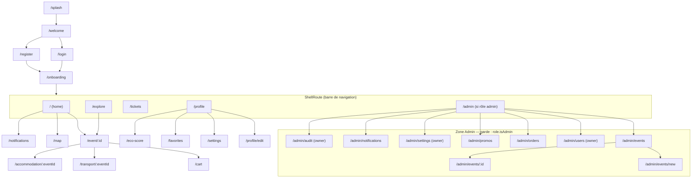

# Diagramme de navigation (GoRouter)

Source : `lib/core/router/app_router.dart`. Une `ShellRoute` héberge les 5 onglets
principaux (+ onglet Admin si rôle). Un `redirect` global gère l'auth, l'onboarding
et la garde `/admin/*`.

## Règles de redirection (`redirect`)
- Non authentifié + route protégée → `/welcome`.
- Authentifié non onboardé → `/onboarding`.
- Route `/admin/*` sans rôle admin → `/` (Home).
- Authentifié sur une page d'auth → `/` (Home).
