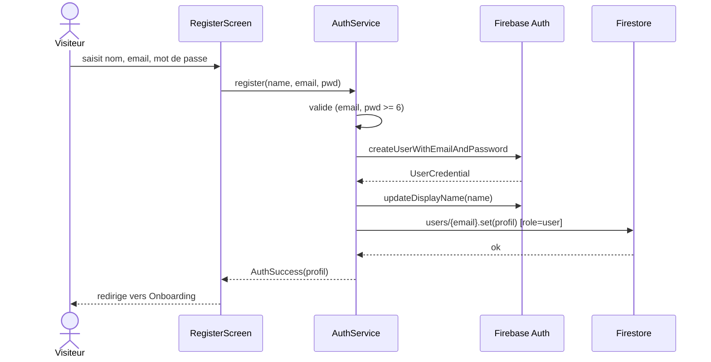
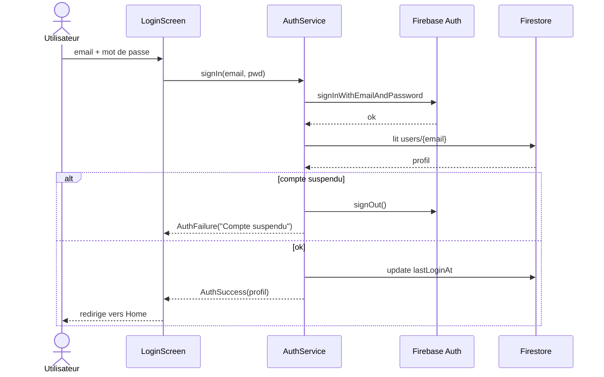
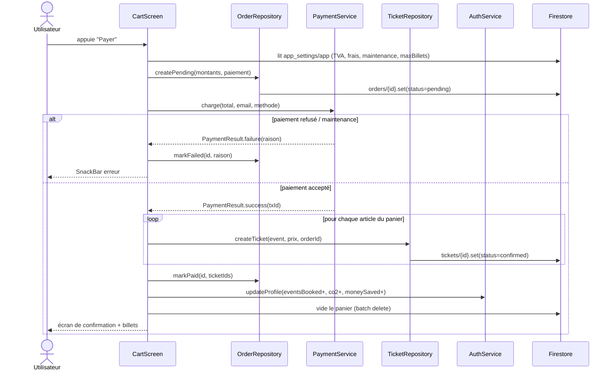
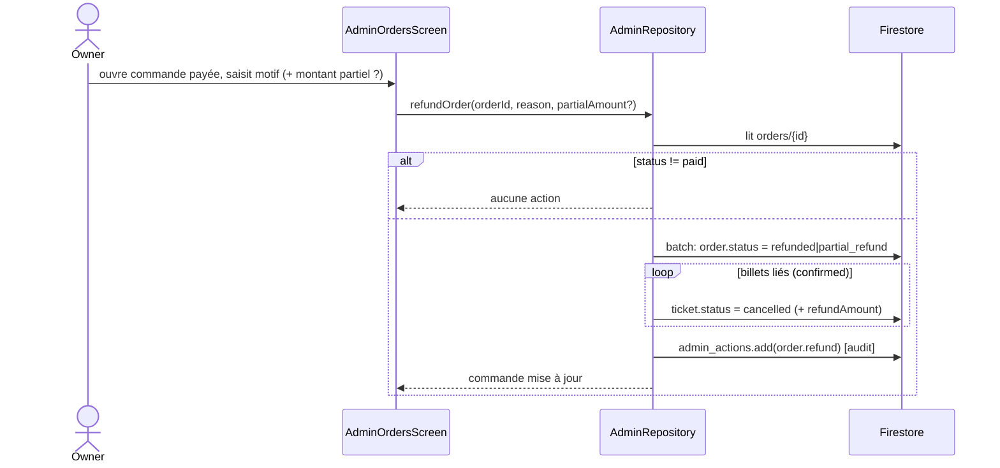

# Diagrammes de séquence (Pulsar)

Flux dynamiques clés. Acteurs techniques : écrans (presentation), services (data),
Firebase Auth, Cloud Firestore.

## 1. Inscription

## 2. Connexion (avec contrôle de suspension)

## 3. Paiement d'une commande (flux central)

## 4. Remboursement par l'administrateur

