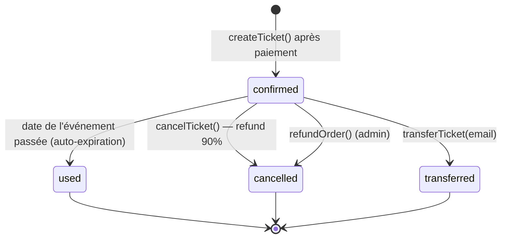
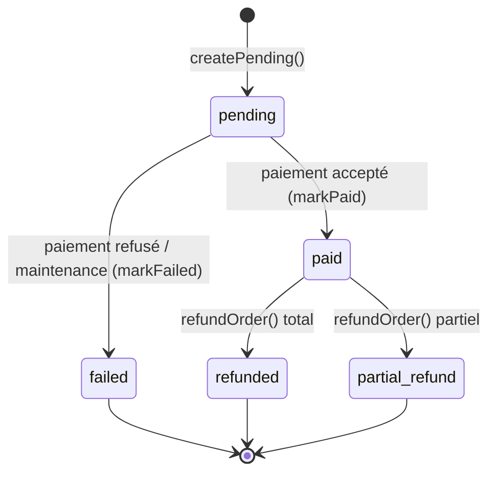
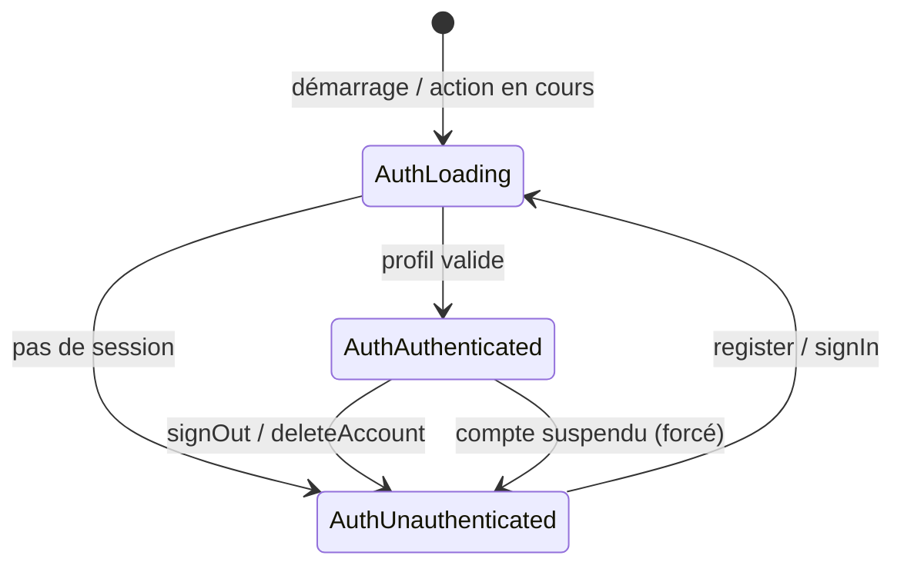

# Diagrammes d'états (Pulsar)

Cycles de vie des entités à statut explicite.

## 1. Cycle de vie d'un billet (TicketStatus)

## 2. Cycle de vie d'une commande (OrderStatus)

## 3. État d'authentification (AuthState)

