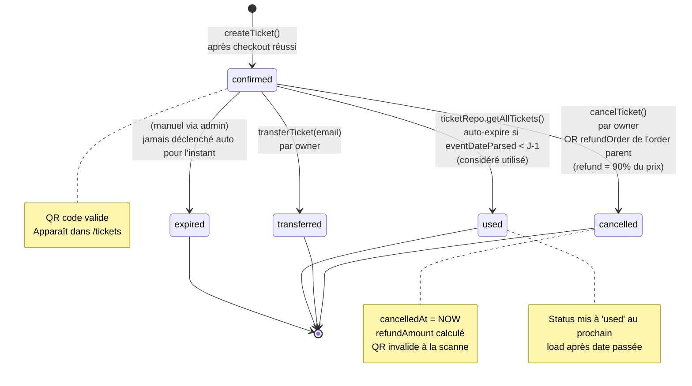
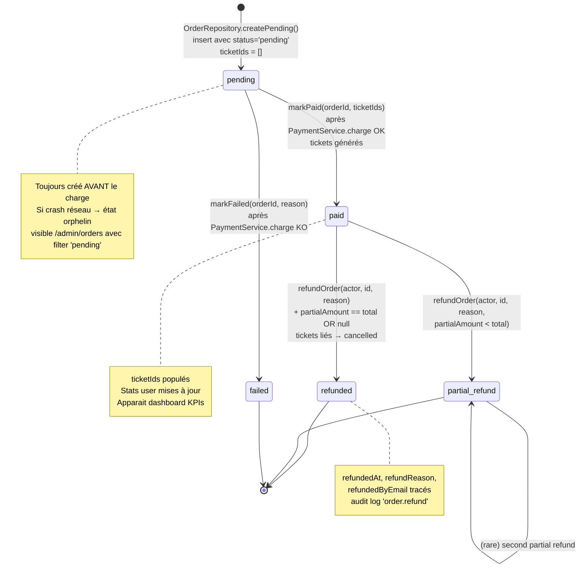
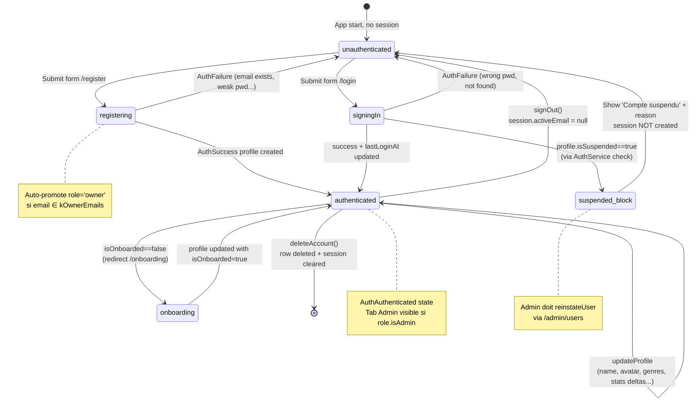
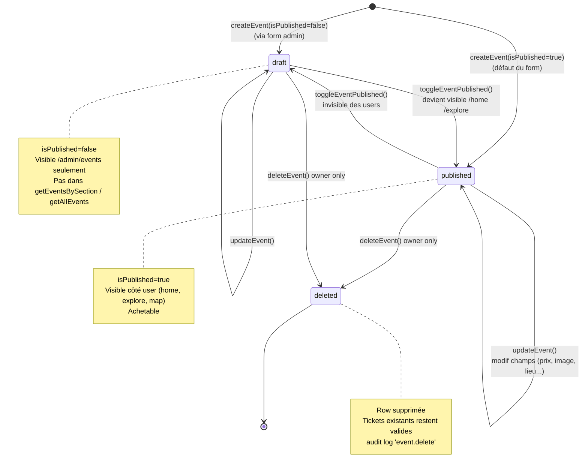
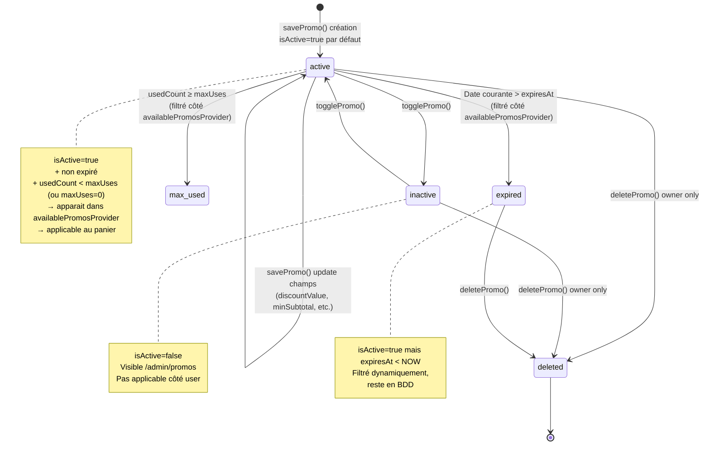
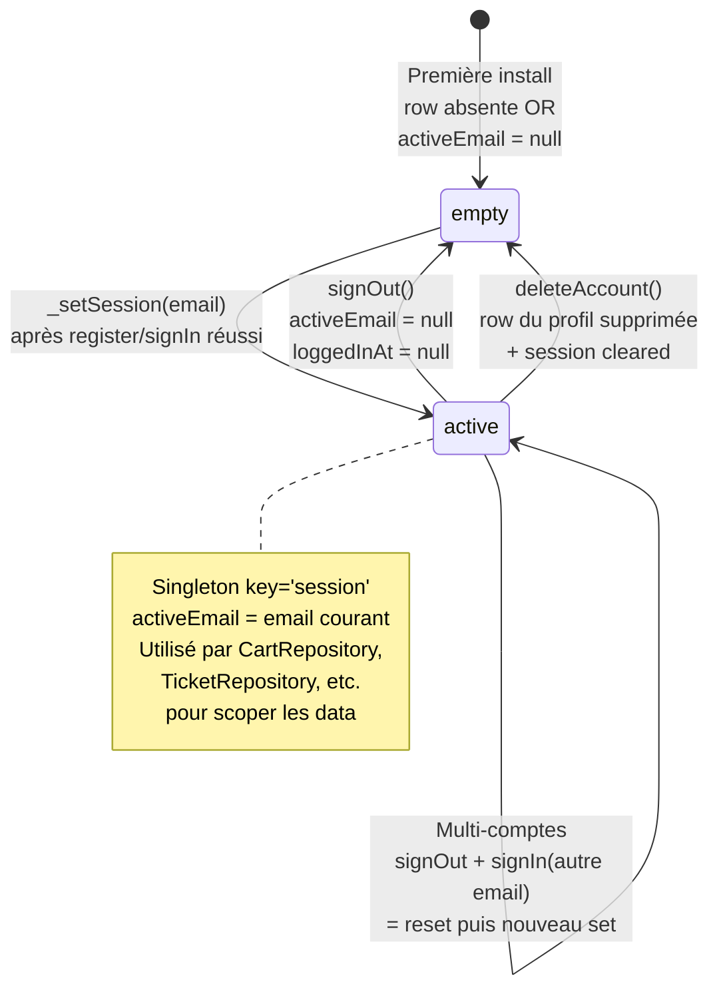
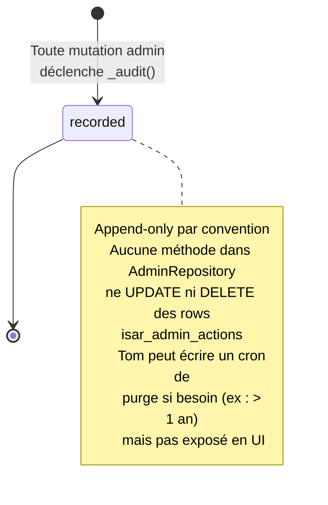

# Pulsar — Diagrammes d'états

Cycles de vie des entités à statut explicite.

## 1. Cycle de vie d'un billet (TicketStatus)

## 2. Cycle de vie d'une commande (Order.status)

## 3. Cycle de vie d'un compte utilisateur

## 4. Cycle de vie d'un événement (admin)

## 5. Cycle de vie d'un code promo

## 6. Cycle de vie d'une session

## 7. Audit log — table append-only

