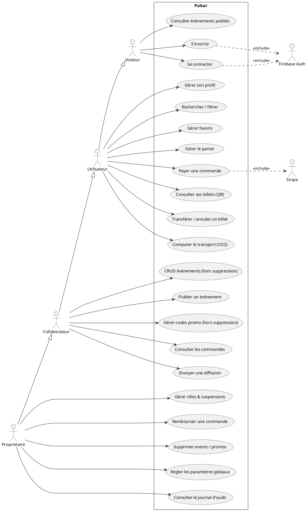

# Diagramme de cas d'utilisation (Pulsar)

Acteurs et héritage : `Propriétaire ⊳ Collaborateur ⊳ Utilisateur`.
Le **Visiteur** (non connecté) est distinct. Systèmes externes : Firebase Auth, Stripe.

## Version PlantUML (rendu : https://www.plantuml.com/plantuml)

## Récapitulatif des droits (RBAC — `lib/features/admin/domain/role.dart`)

| Capacité | user | collaborator | owner |
|----------|:----:|:------------:|:-----:|
| Consulter / réserver | ✅ | ✅ | ✅ |
| Créer / éditer / publier événement | ❌ | ✅ | ✅ |
| Supprimer événement | ❌ | ❌ | ✅ |
| Gérer codes promo | ❌ | ✅ | ✅ |
| Supprimer code promo | ❌ | ❌ | ✅ |
| Voir commandes | ❌ | ✅ | ✅ |
| Rembourser | ❌ | ❌ | ✅ |
| Gérer utilisateurs (rôles/suspension) | ❌ | ❌ | ✅ |
| Paramètres globaux | ❌ | ❌ | ✅ |
| Journal d'audit | ❌ | ❌ | ✅ |
| Envoyer diffusion | ❌ | ✅ | ✅ |
